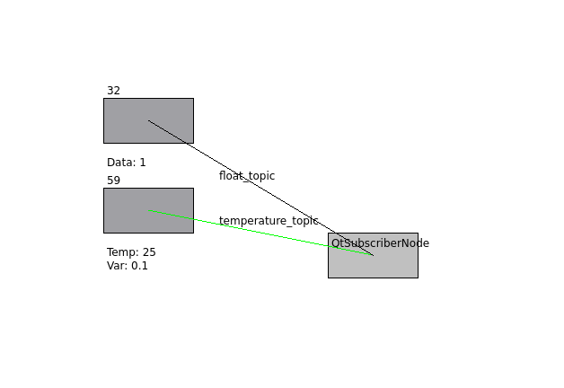
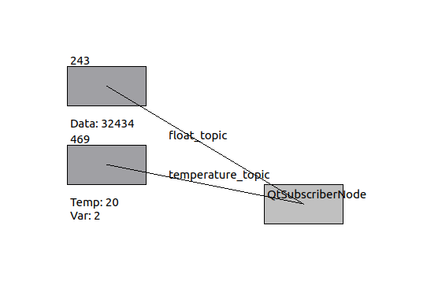

# Run instruction: 

Due to many dependencies, it is recommended to use the docker image. If you want to run it on your local machine, please follow the instructions below and make sure you have all the dependencies installed.

## Dependencies

```bash
sudo apt-get update && apt-get install -y \
    build-essential \
    cmake \
    git \
    libgl1-mesa-glx \
    libgl1-mesa-dri \
    libxrandr2 \
    libxss1 \
    libxcursor1 \
    libxcomposite1 \
    libasound2 \
    libxi6 \
    libxtst6 \
    qtbase5-dev \
    qtchooser \
    qt5-qmake \
    qtbase5-dev-tools \
    python3-colcon-common-extensions \
    ros-humble-desktop 
```

## Build

Clone the repository and build the package:

```bash
mkdir -p ~/ros_ws/src
git clone <the url> 
cd ~/ros_ws
colcon build --cmake-args -DCMAKE_BUILD_TYPE=Release --symlink-install
```

## Run

```bash
. install/setup.bash
ros2 launch xberry_test multi_sensor_launch.py float:=5 temperature:=5
```


## Dynamic Reconfigure

```bash
. install/setup.bash
ros2 service call /set_publish_frequency xberry_test/srv/SetFrequency "{frequency: 2.0}"  # this will set all the publishers the frequency to 2.0
```

Change the temperature data: 

```bash
ros2 service call /set_temperature_data xberry_test/srv/SetTemperature "{temperature: 20.0, variance: 2.0}"
```

Change the float data: 

```bash
ros2 service call /set_float_data xberry_test/srv/SetFloat "data: 32434.0"
```

## Run visualization

```bash
ros2 run xberry_test qt_subscriber_node
```

result:




After running the reconfigure service, you can see the changes in the visualization.




## Docker

Navigate to the docker folder (root of the repo) `cd ~/ros_ws/src/xberry_test` or (`git clone <the url>` and `cd xberry_test`)

```bash
docker build -t xberry_test .
```

RUN:
    
```bash
xhost +local:docker
docker run -it --rm \
    --net=host \
    --env="DISPLAY" \
    --env="QT_X11_NO_MITSHM=1" \
    --volume="/tmp/.X11-unix:/tmp/.X11-unix:rw" \
    xberry_test
```

## Run with docker-compose

### Prerequisites

If you don't have docker/docker-compose installed, you can install it following the official [documentation](https://docs.docker.com/compose/install/).

### Build

Use the docker-compose in the following way:

```bash
docker-compose up --build
```

### In case of errors

If you get an error with wolumes: 

```bash
docker-compose down --volumes
```

Then run the docker-compose again:

```bash
docker-compose up --build
```
### launch

On pen the new terminal and run: 

```bash
docker exec -it xberry_test bash
ros2 launch xberry_test multi_sensor_launch.py float:=5 temperature:=4
```

Open another terminal and run:

```bash
xhost +local:docker
docker exec -it xberry_test bash
ros2 run xberry_test qt_subscriber_node
```

In case of errors like: 

```bash
ros2 run xberry_test qt_subscriber_node
Authorization required, but no authorization protocol specified
qt.qpa.xcb: could not connect to display :1
qt.qpa.plugin: Could not load the Qt platform plugin "xcb" in "" even though it was found.
This application failed to start because no Qt platform plugin could be initialized. Reinstalling the application may fix this problem.

Available platform plugins are: eglfs, linuxfb, minimal, minimalegl, offscreen, vnc, xcb.

[ros2run]: Aborted
```

Exit the container and run `xhost +local:docker` and rerun the docker exec command.


## Explanation


The boxes represents the nodes, and the lines topics. 

Above the boxes you can see the number of the messages received by the subscriber.

The data below the boxes are the newest data received by the subscriber.

